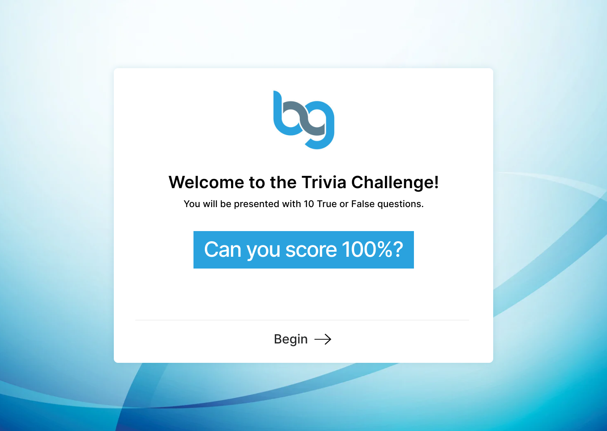
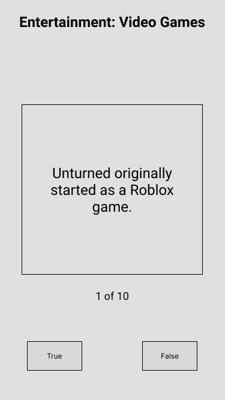

# Koda JavaScript Coding Challenge

## Overview

Your challenge is to create a simple, 10 question, true or false, trivia app in the technology you are familiar with. While the problem you are working on is simple, you should treat this like a real world application. This is a chance to show off your abilities and impress.

**What we are looking for through this challenge:**

- Functionality
- Code Format
- Project Structure
- Scalability
- Maintainability
- Use of industry best practices

## Goals

Implement the screens based on the wireframes and api below using advanced techniques and industry best practices for your platform. Note that the wireframes may not be complete, so use your best judgment for UI/UX implementation. **Do not use a boilerplate like React Boilerplate for this challenge.** We want to see how you structure your project and what tooling you use from scratch. Create react app is fine to use.

## Details

Data:

The api url is: https://opentdb.com/api.php?amount=10&difficulty=hard&type=boolean

Sample returned json:

```javascript
{
  "response_code": 0,
  "results": [
    {
      "category": "Entertainment: Video Games",
      "type": "boolean",
      "difficulty": "hard",
      "question": "Unturned originally started as a Roblox game.",
      "correct_answer": "True",
      "incorrect_answers": [
        "False"
      ]
    },…]}
```

### Intro / Home Screen:



- Static Text
- BEGIN button navigates to the Quiz screen and starts the Quiz

### Quiz Screen:



- The headline is from question category
- The card element contains the current question
- The next question should appear after the current question is answered True or False
- After all questions have been answered, navigate to the Results Screen

### Results screen:


- The Score shows correct and total
- Displays a list of the questions and whether the answer was correct or not
- PLAY AGAIN starts over and navigates to the Home Screen

## Submission

Please use git for version control and platforms like Github to host the repository. Once you have finished your challenge, send us the repository url. It would be even better if you can have a documentation for how to run your code in our environment.